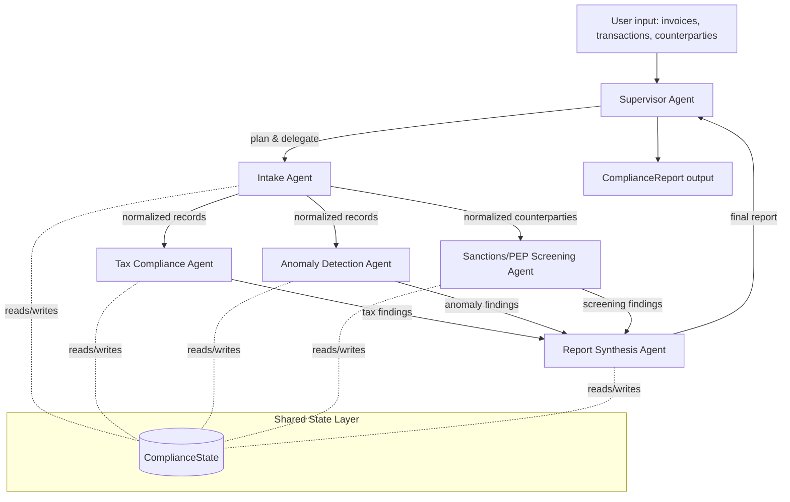

# UAE Compliance Copilot

An open-source, multi-agent system that reviews a UAE SME's invoices, transactions, and counterparties and
produces one compliance report covering VAT/Corporate Tax reconciliation, FTA e-invoicing field readiness, and
sanctions/PEP screening.

> **Disclaimer**: This is a decision-support tool, not tax, legal, or compliance advice. Findings and risk scores
> are generated by rule-based checks and LLM reasoning that can be wrong or incomplete. Always verify with a
> qualified UAE tax advisor / compliance officer before filing or acting on any finding here.

## Why this exists

UAE SMEs now have to reconcile financial records against Corporate Tax, VAT, and (as of the pilot that began July
2026) a new mandatory e-invoicing schema -- largely by hand, with no dedicated compliance team. Non-compliant
invoices carry a flat AED 2,500 penalty each; e-invoicing non-compliance carries AED 5,000/month. Meanwhile UAE
DNFBPs and fintechs post hundreds of open AML/KYC compliance roles at any given time, signaling the same
manual-review bottleneck. See [`docs/research.md`](docs/research.md) for the full evidence and
[`docs/validation.md`](docs/validation.md) for why this problem is a good fit for an agentic system rather than a
single script.

## Architecture

A Supervisor agent plans and delegates to four specialist agents through a lightweight DAG engine, then a Report
Synthesis agent merges everything into one report. Full rationale in [`docs/architecture.md`](docs/architecture.md).



Each specialist is independently swappable/disable-able (see [Adding a new agent](#adding-a-new-agent) below), and
every agent's LLM calls go through a single provider-agnostic interface (see
[Swapping LLM providers](#swapping-llm-providers)).

## Quick start (under 5 minutes)

```bash
git clone <this-repo>
cd uae-compliance-copilot
pip install -e ".[dev]"
cp .env.example .env
```

By default `.env.example` is configured for **Ollama** (local, no API key). Either start Ollama:

```bash
ollama serve &
ollama pull llama3.1
```

...or edit `.env` to point at a cloud provider (see below), or skip the LLM entirely for a first look:

```bash
# No LLM required -- see deterministic rule-based findings + fallback report text
python examples/run_with_mock.py

# Full run against your configured provider
python examples/run_sample.py

# Or via the installed CLI against your own JSON file
compliance-copilot examples/sample_data/sample_input.json
```

Input shape is a JSON object with `invoices`, `transactions`, and `counterparties` arrays -- see
`examples/sample_data/sample_input.json` for the full schema (backed by the Pydantic models in
`src/compliance_copilot/memory/state.py`).

## Configuration reference

All configuration is via environment variables (or a `.env` file) -- see [`.env.example`](.env.example) for the
canonical, commented list. Key variables:

| Variable | Purpose |
|---|---|
| `LLM_PROVIDER` | `openai` \| `anthropic` \| `ollama` \| `azure` \| `groq` \| `custom` -- default provider for any agent role without an override |
| `LLM_MODEL` | Model name string for the default provider |
| `LLM_BASE_URL` | Endpoint override (required for `ollama`/`custom`) |
| `LLM_API_KEY` | API key (not required for `ollama`) |
| `ORCHESTRATOR_LLM_*` | Optional override so the Supervisor uses a different provider/model (e.g. a stronger cloud model) |
| `SUBAGENT_LLM_*` | Optional override so specialist agents use a different provider/model (e.g. a cheap/local model) |
| `LLM_MAX_RETRIES`, `LLM_TIMEOUT_SECONDS` | Retry/timeout policy for LLM calls |
| `MAX_TOKENS_PER_RUN` | Soft token budget for a single pipeline run (0 = unlimited) |
| `SANCTIONS_MATCH_THRESHOLD` | Fuzzy-match strictness (0-100) for sanctions/PEP screening |
| `LOG_LEVEL` | `DEBUG` \| `INFO` \| `WARNING` \| `ERROR` |

## Swapping LLM providers

Every agent calls its LLM through `compliance_copilot.llm.LLMProvider` -- never a vendor SDK directly -- so switching
providers is a configuration change, not a code change:

```bash
# Cloud
LLM_PROVIDER=openai LLM_MODEL=gpt-4o-mini LLM_API_KEY=sk-...

# Cloud (Anthropic)
LLM_PROVIDER=anthropic LLM_MODEL=claude-sonnet-5 LLM_API_KEY=sk-ant-...

# Local (Ollama)
LLM_PROVIDER=ollama LLM_MODEL=llama3.1 LLM_BASE_URL=http://localhost:11434

# Local/self-hosted, OpenAI-compatible (llama.cpp, vLLM, LM Studio, ...)
LLM_PROVIDER=custom LLM_MODEL=my-local-model LLM_BASE_URL=http://localhost:8000/v1

# Hybrid: strong cloud model for the Supervisor, cheap local models for specialists
LLM_PROVIDER=ollama LLM_MODEL=llama3.1
ORCHESTRATOR_LLM_PROVIDER=anthropic ORCHESTRATOR_LLM_MODEL=claude-sonnet-5 ORCHESTRATOR_LLM_API_KEY=sk-ant-...
```

To add a brand new provider, implement `LLMProvider.generate()` in `src/compliance_copilot/llm/providers/`, and
register it in `PROVIDER_REGISTRY` in `src/compliance_copilot/llm/factory.py`. Nothing else changes.

## Adding a new agent

1. Subclass `BaseAgent` in `src/compliance_copilot/agents/` and implement `run(self, state: ComplianceState) ->
   ComplianceState`. Read only the `ComplianceState` fields you need; append your findings to `state` and return it.
2. Register it in `Supervisor.build_graph()` (`src/compliance_copilot/agents/supervisor.py`) via
   `graph.add_node("my_agent", self.my_agent.safe_run, depends_on=[...])`. Use the `condition=` kwarg if the agent
   should only run under certain conditions (see how `sanctions_screening` is skipped when there are no
   counterparties).
3. Add fields to `ComplianceState` (`src/compliance_copilot/memory/state.py`) if your agent produces new structured
   output, and merge it into `ComplianceReport` in `report_synthesis.py` if it should appear in the final report.
4. Write unit tests with a `MockProvider` (see any file in `tests/unit/test_agents_*.py` for the pattern) and add an
   integration assertion in `tests/integration/test_pipeline.py`.

Agents are disable-able by simply not adding their node to the graph (or by removing the call in
`Supervisor.__init__`/`build_graph`), and swappable by passing an alternate instance into `Supervisor(...)`'s
constructor kwargs.

## Running tests

```bash
pip install -e ".[dev]"
pytest                                    # run the suite
pytest --cov=src --cov-report=term-missing  # with coverage (currently 94%)
```

The entire suite runs offline against `MockProvider` -- no API keys or network access required. `tests/unit/` covers
individual agents, tools, providers (with `httpx` monkeypatched), the graph engine, and config resolution;
`tests/integration/` covers full-pipeline execution, conditional node skipping, partial-failure recovery,
provider/role switching, and the API layer (`tests/integration/test_api.py`).

## API & Web layer

A FastAPI service (`api/`) sits on top of the library -- it's a pure *consumer* of `Supervisor`, so none of the
core agent code changes to support it. It gives you a JSON API for programmatic use and a small server-rendered
web dashboard for humans, both backed by the same pipeline run.

```bash
pip install -e ".[dev,api]"
make api
# or: uvicorn api.app:app --reload
```

Then open `http://127.0.0.1:8000/web` for the dashboard (upload a JSON file, or click "Try it with sample data"),
or `http://127.0.0.1:8000/docs` for interactive OpenAPI docs. Endpoints:

| Method & path | Purpose |
|---|---|
| `POST /api/reports` | Run the pipeline against a JSON body (`{"invoices": [...], "transactions": [...], "counterparties": [...]}`), returns the report |
| `POST /api/reports/upload` | Same, but as a multipart file upload |
| `GET /api/reports` | List recent runs (id, risk score, summary) |
| `GET /api/reports/{id}` | Fetch one full report by id |
| `GET /web` | HTML dashboard: upload form + recent runs |
| `GET /web/reports/{id}` | HTML report view |
| `GET /health` | Liveness check |

Design notes:
- Each pipeline run involves several LLM calls, so requests run in a worker thread
  (`starlette.concurrency.run_in_threadpool`) rather than blocking the event loop -- the Supervisor itself stays
  fully synchronous, no agent code had to become async.
- Reports are persisted to a local SQLite file (`compliance_copilot_api.db` by default, override with
  `API_DB_PATH`) as JSON blobs -- no ORM, since `ComplianceReport` is already a versioned Pydantic model.
- The `Supervisor` used per-request is resolved via a FastAPI dependency (`api/deps.py::get_supervisor`), which is
  exactly how the test suite (`tests/integration/test_api.py`) swaps in a `MockProvider`-backed supervisor with
  `app.dependency_overrides` -- no network calls in CI here either.
- Not yet built: auth/rate-limiting (needed before this is public-facing, since every request costs LLM tokens),
  and real-time per-agent progress streaming (the `GraphEngine` already reports executed/skipped/failed nodes per
  run -- extending that into SSE/WebSocket events for the dashboard is a natural next step).

## Project structure

```
docs/            research.md, validation.md, architecture.md
src/compliance_copilot/
  agents/        supervisor + 5 specialist agents
  llm/           provider-agnostic LLM interface + concrete providers + mock
  graph/         lightweight DAG orchestration engine
  tools/         sanctions screening, tax/e-invoicing rules, anomaly rules, retry helper
  memory/        shared ComplianceState (Pydantic) threaded through the graph
  config.py      environment-variable-driven settings
  cli.py         `compliance-copilot` entry point
api/             FastAPI JSON API + server-rendered web dashboard (consumes the library above)
  routes.py      JSON API endpoints
  web.py         HTML dashboard routes
  service.py     shared run-pipeline-and-store logic used by both
  store.py       SQLite-backed report persistence
  templates/     Jinja2 templates for the dashboard
tests/
  unit/          per-component tests, mocked LLM
  integration/   full-graph, provider-switching, and API layer tests
examples/        runnable examples + sample input data
```

## Contributing

Issues and PRs welcome. Please: run `ruff check . --fix && ruff format .` and `pytest --cov=src` before opening a
PR; keep new agents/tools covered by tests (mocked LLM, no live API calls in CI); update `docs/architecture.md`'s
Mermaid diagram if you change the agent graph; and add a `CHANGELOG.md` entry for user-visible changes.

## License

MIT -- see [`LICENSE`](LICENSE).
