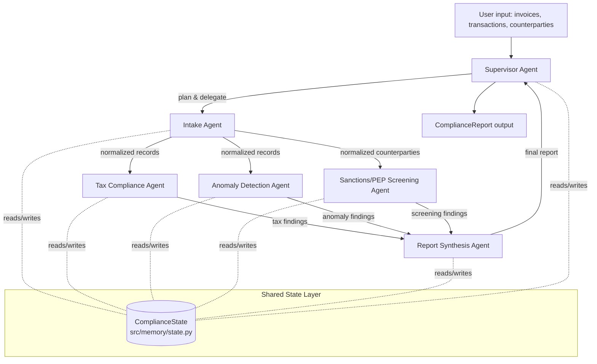

# Architecture

## Orchestration pattern

We use a **custom lightweight DAG engine** (`src/graph/engine.py`) rather than pulling in LangGraph/AutoGen/CrewAI.
Justification: the pipeline is a fixed, shallow DAG (intake → three parallel specialists → synthesis) with no need
for cyclic re-planning, streaming token graphs, or the large dependency surface those frameworks bring. A ~150-line
topological executor gives us the same guarantees (explicit dependencies, per-node error isolation, shared state
passing) with zero extra runtime dependencies, which keeps the project easy to audit and install. The engine is
still swappable — `GraphEngine` is a small enough interface that a LangGraph-backed implementation could be dropped
in behind the same `run()` contract if a project needs cyclic/re-planning behavior later.

## Agent graph

- **Supervisor Agent** (`src/agents/supervisor.py`): plans which specialists to run (e.g. skips sanctions screening
  if no counterparties are supplied — a real planning decision, not just a fixed pipeline call), delegates via the
  graph engine, and synthesizes the final executive summary.
- **Intake Agent**: normalizes heterogeneous raw dict/JSON input into typed Pydantic records (`Invoice`,
  `Transaction`, `Counterparty`), tagging parse failures instead of dropping them silently.
- **Tax Compliance Agent**: validates each invoice against VAT/e-invoicing mandatory-field rules and classifies
  VAT/CT treatment, using an LLM for ambiguous free-text classification with a deterministic rules fallback.
- **Sanctions/PEP Screening Agent**: fuzzy-matches counterparties against a bundled sample sanctions/PEP list
  (swappable for a live OFAC/UN feed) and produces confidence-scored hits for human review.
- **Anomaly Detection Agent**: deterministic reconciliation checks — duplicate invoice numbers, round-number
  transactions, total mismatches — augmented by an LLM narrative explaining *why* a flagged item looks off.
- **Report Synthesis Agent**: merges all specialist outputs into a single `ComplianceReport` with a risk score and
  prioritized action list.

Each specialist agent is independently composable: it can be disabled via config, run standalone in tests, or
replaced with an alternate implementation as long as it honors the same `BaseAgent.run(state) -> state` contract.

## Shared state / memory layer

`src/memory/state.py` defines `ComplianceState`, a single Pydantic model threaded through the graph. Agents read the
fields they need and return a partial update merged back into state — this avoids re-sending full conversation
history/context to every agent (each agent only sees the structured slice of state it declares) and keeps token
usage bounded and predictable.

## LLM configuration (provider abstraction)

All agents call an LLM through the single interface `src/llm/base.py::LLMProvider.generate(messages) -> LLMResponse`.
Concrete providers (`src/llm/providers/`) implement this interface over each backend's HTTP API using `httpx`
directly rather than each vendor's SDK, keeping dependencies minimal:

| Env var | Purpose |
|---|---|
| `LLM_PROVIDER` | `openai` \| `anthropic` \| `ollama` \| `azure` \| `groq` \| `custom` |
| `LLM_MODEL` | model name string |
| `LLM_BASE_URL` | override endpoint (required for `ollama`/`custom`, optional override for others) |
| `LLM_API_KEY` | API key (not required for `ollama`) |
| `ORCHESTRATOR_LLM_PROVIDER` / `ORCHESTRATOR_LLM_MODEL` | optional override so the Supervisor can use a stronger cloud model |
| `SUBAGENT_LLM_PROVIDER` / `SUBAGENT_LLM_MODEL` | optional override so specialist agents use a cheaper/local model |

This gives three supported modes out of the box: **cloud** (openai/anthropic/azure/groq), **local** (`ollama`, or
any OpenAI-compatible local server such as llama.cpp/vLLM via `custom` + `LLM_BASE_URL`), and **hybrid** (set the
`ORCHESTRATOR_*` vars to a cloud model and leave sub-agents on the local default, or vice versa). `src/llm/factory.py`
resolves the right provider per-agent-role with zero code changes required to switch — only environment variables.
A `MockProvider` (`src/llm/mock.py`) implements the same interface for tests, so the entire test suite runs with no
network access or API keys.

## Error handling & token budget

`src/tools/retry.py` provides a `with_retry` decorator (exponential backoff, max attempts from config) used by every
agent's LLM call. Agents catch provider errors and malformed-response errors and return a structured `AgentError` in
state rather than raising, so the graph engine can continue with partial results and the Supervisor can report which
steps failed. `ComplianceState.token_usage` accumulates estimated token counts per agent call, and
`Config.max_tokens_per_run` acts as a soft budget the Supervisor checks before delegating to remaining agents.

## Project structure

See repository root — mirrors the structure specified in the project brief (`src/agents`, `src/llm`, `src/graph`,
`src/tools`, `src/memory`, `tests/{unit,integration}`, `docs`, `examples`).
